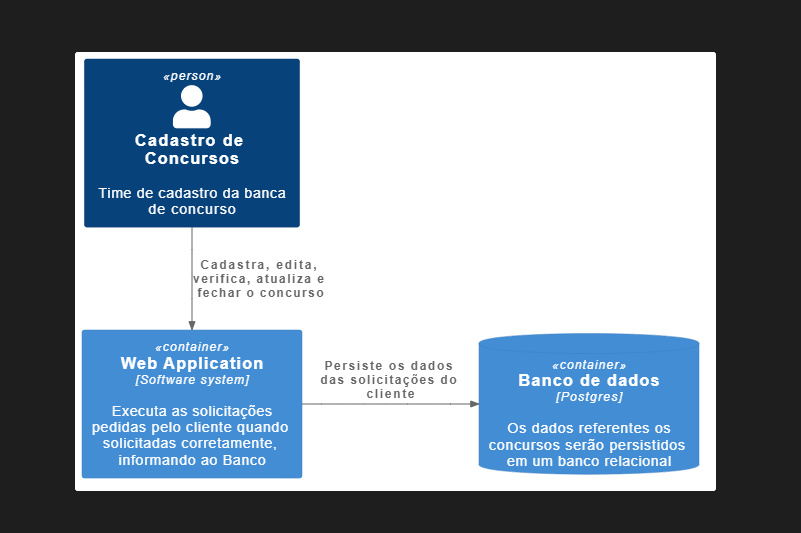

# API de cadastro de concursos
Essa Api é responsavel por operações referentes a provas de concursos, no qual um time de cadastro será responsavel pelos cadastros de novos concursos.
Esse mesmo sistema ainda será implementado as rotas a serem usadas para que as pessoas possam se cadastrar nos concursos desejados.

*No momento a API esta com o foco para o desenvolvimento das operações do time de cadastros dos concursos.*

## Diagrama de contexto da API
